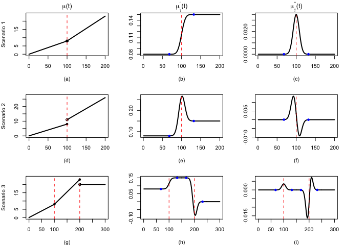
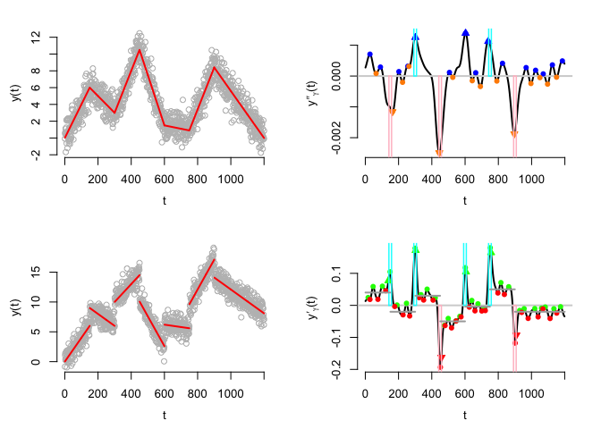
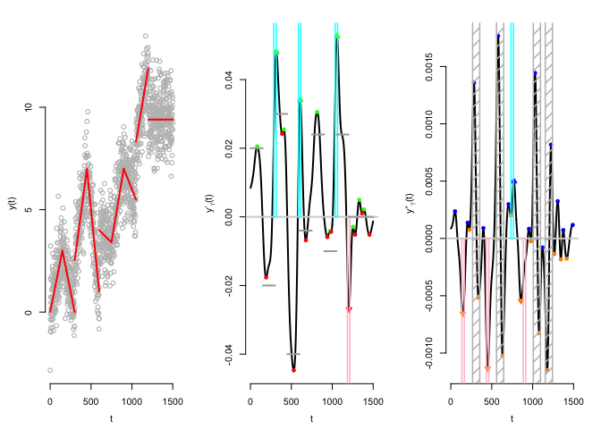

An R package for change point detection: dSTEM
================
Zhibing He
June 20, 2023

dSTEM: differential Smoothing and TEsting of Maxima/Minima
----------------------------------------------------------

A new generic and low-computational approach for multiple change points detection in linear models. The method is designed for the data sequence modeled as piecewise linear signal plus correlated random noise (a stationary Gaussian process) <https://doi.org/10.1214/20-EJS1751>. The research paper for change point detection of general piecewise linear model will be available soon...

Toy Example of the Method
-------------------------

The core idea of our method is to transform the change points into local maxima/minima of the differential smoothed data. By performing multiple testing on the local maxima/minima, the significant ones are detected as change points.

For example, a continuous change point will be transformed into a local maximum/minimum in the second derivative of the smoothed data, while a noncontinuous change point will be transformed into a local maximum/minimum in the first derivative of the smoothed data. A toy example is illustrated as follows





Usage
-----

The main function is 'dstem()', which detect the change points in piecewise constant and piecewise linear signals.

``` r
l = 1200
h = seq(150,by=150,length.out=6)
jump = rep(0,7)
beta1 = c(2,-1,2.5,-3,-0.2,2.5)/50
beta1 = c(beta1,-sum(beta1*(c(h[1],diff(h))))/(l-tail(h,1)))
signal = gen.signal(l,h,jump,beta1)
noise = rnorm(length(signal),0,1)
gamma = 25
unlist(dstem(signal + noise,"I",gamma=gamma,alpha=0.05))
```

    ## vall1 vall2 vall3 peak1 peak2 peak3 
    ##   154   448   894   291   599   745

``` r
## piecewise constant
l = 1200
h = seq(150,by=150,length.out=6)
jump = c(0,1.5,2,2.2,1.8,2,1.5)
beta1 = rep(0,length(h)+1)
signal = gen.signal(l,h,jump,beta1)
noise = rnorm(length(signal),0,1)
gamma = 25
unlist(dstem(signal + noise, "II-step",gamma,alpha=0.05))
```

    ## peak1 peak2 peak3 peak4 peak5 peak6 
    ##   149   300   451   596   750   893

``` r
## piecewise linear with jump
l = 1200
h = seq(150,by=150,length.out=6)
jump = c(0,1.5,2,2.2,1.8,2,1.5)*3
beta1 = c(2,-1,2.5,-3,-0.2,2.5,-0.5)/50
signal = gen.signal(l=l,h=h,jump=jump,b1=beta1)
noise = rnorm(length(signal),0,1)
gamma = 25
unlist(dstem(signal + noise, "II-linear",gamma,alpha=0.05))
```

    ## peak1 peak2 peak3 peak4 peak5 peak6 
    ##   138   307   440   607   756   892
